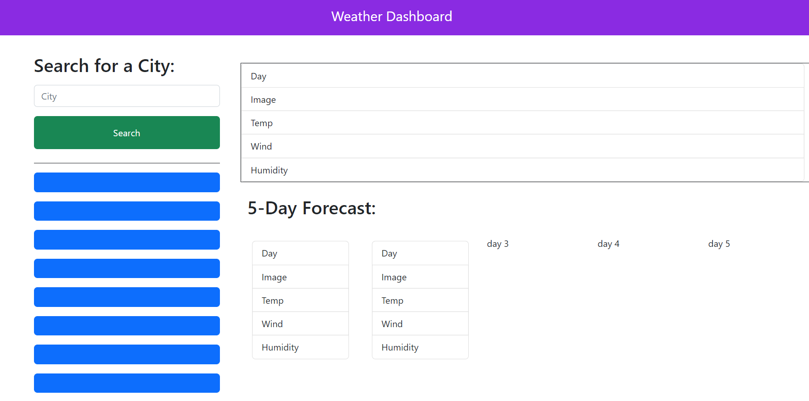

# Module6 Challenge: 5 Day Weather Forecast

## Description

Present a search prompt for city weather data to show the current weather and a 5 day forecast

## Tasks accomplished

<ul>
    <li>Used local storage to store up to 8 cities to show weather data upon click</li>
    <li>Used openweather api to obtain weather data on the searched city</li>
    <li>Used bootstrap and jquery to create webpage style and use shorthand javascript code.</li>
</ul>

## Website Link

Link to deployed website is [5 Day Forecast](https://larsonrj.github.io/weatherDashboard/)

## Website Preview

